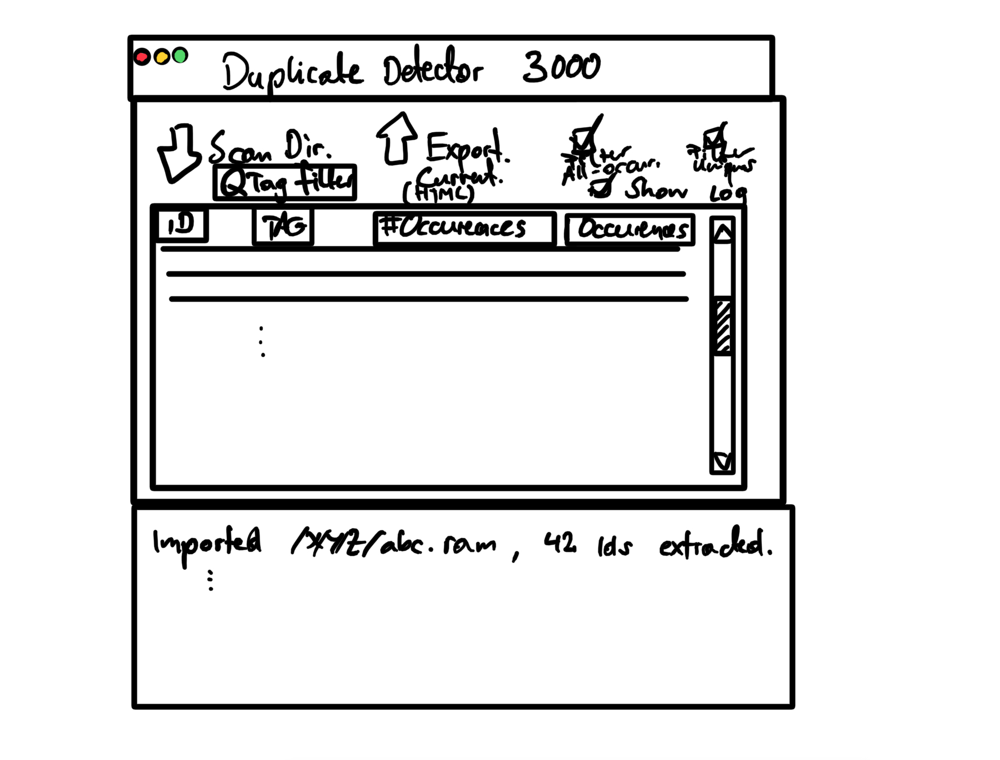

# Functional specfications

## Input configurations

 * Options
   * Dialogue based
   * Command line arguments
   * Configuration file
   * UI
     * Desktop UI
     * Web UI

 > Easiest option: configuration file. Easy to automate, easy to implement.

 * Inputs
   * Master source models folder location
   * Master template location
   * Possibly: Expected amount inputs

## Output configuration

 * Textual
 * Logfile
 * Display with UI options for sort / filter criteria
 * Export

## Sample UI

A sample UI, to help identify required functionality

